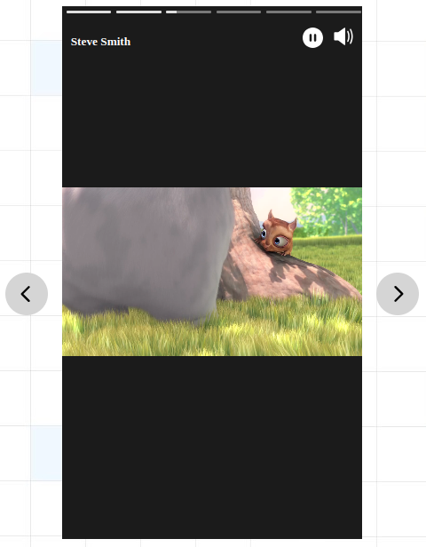

# Ngx Stories

An Angular component to render instagram like stories.

[](https://www.npmjs.com/package/ngx-stories)
[](https://www.npmjs.com/package/ngx-stories)

## Screenshot



## For Version 17+

## Installation

Install the library via npm:

```bash
npm install ngx-stories
```

## Usage

Import the `NgxStoriesComponent` in your component or module.

```ts
import { Component } from '@angular/core';
import { NgxStoriesComponent, StoryGroup } from 'ngx-stories';

@Component({
  selector: 'app-root',
  standalone: true,
  imports: [NgxStoriesComponent],
  templateUrl: './app.component.html',
  styleUrl: './app.component.css'
})
export class AppComponent {
  storyGroups: StoryGroup[] = [
    {
      name: 'John Doe',
      stories: [
        { type: 'image', content: 'https://example.com/story1.jpg' },
        { type: 'component', content: CustomComponent }, // pass any angular component
      ],
    },
    {
      name: 'Jane Smith',
      stories: [
        { type: 'video', content: 'https://example.com/video-story.mp4' },
      ],
    },
  ];
}
```

```html
<ngx-stories [storyGroups]="storyGroups"></ngx-stories>
```

## API Reference

### Inputs

| Property      | Type                  | Required | Description |
|---------------|-----------------------|----------|-------------|
| `storyGroups` | `StoryGroup[]`        | Yes      | An array of story groups to display. |
| `options`     | `NgxStoriesOptions`   | No       | Configuration options for the stories. |

### Outputs

| Event | Payload Type | Description |
|-------|--------------|-------------|
| `triggerOnEnd` | `void` | Emitted when all stories in all groups have finished playing. |
| `triggerOnExit` | `void` | Emitted when the user triggers an exit action (e.g., swipe down). |
| `triggerOnSwipeUp` | `void` | Emitted when the user swipes up on a story. |
| `onStoryGroupChange` | `number` | Emitted when the story group changes. Payload is the new group index. |
| `triggerOnStoryChange` | `StoryChange` | Emitted when the individual story changes. see `StoryChange` interface below. |

### Interfaces

#### `StoryGroup`
```ts
interface StoryGroup {
  id?: string;      // Unique identifier (auto-assigned if missing)
  name: string;     // Name of the user/group displayed in the header
  stories: Story[]; // Array of stories for this group
}
```

#### `Story`
```ts
interface Story {
  id?: string;      // Unique identifier (auto-assigned if missing)
  type: 'image' | 'video' | 'component';
  content: string | Type<Component>; // URL for image/video, or Component class
}
```

#### `NgxStoriesOptions`
```ts
interface NgxStoriesOptions {
  width?: number;                 // Width of the story container (default: 338)
  height?: number;                // Height of the story container (default: 600)
  currentStoryIndex?: number;     // Start index for stories within a group (default: 0)
  currentStoryGroupIndex?: number;// Start index for story groups (default: 0)
  backlitColor?: string;         // Background color behind the story media (default: '#1b1b1b')
  enableGradientBackground?: boolean; // Enable Instagram-like gradient background (default: true)
}
```

#### `StoryChange` (Payload for `triggerOnStoryChange`)
```ts
interface StoryChange {
  currentPerson: string;
  currentPersonIndex: number;
  currentStory: Story;
  currentStoryIndex: number;
  previousStory: Story | null;
  previousStoryIndex: number | null;
}
```

## Features

### Navigation & Gestures
- **Swipe Left/Right**: Navigate between stories and story groups (Mobile friendly).
- **Swipe Down**: Triggers the `triggerOnExit` event (typically used to close the story viewer).
- **Swipe Up**: Triggers the `triggerOnSwipeUp` event (can be used for "See More" links).
- **Tap**:
    - **Right side**: Go to next story.
    - **Left side**: Go to previous story.
- **Hold**: Pause the story. Release to resume.

### Keyboard Support
- **Arrow Right**: Next story.
- **Arrow Left**: Previous story.
- **Space**: Toggle Pause/Play.
- **Escape**: triggers `triggerOnExit`.

### Background Effects
- **Gradient Background**: Automatically extracts dominant colors from the image/video and creates a dynamic, smooth gradient background (similar to Instagram). Can be disabled via `options.enableGradientBackground: false`.
- **Backlit Color**: Fallback background color if gradient is disabled or color extraction fails.

### Media Support
- **Images**: Preloading included.
- **Videos**: Auto-play, muted by default (toggle audio by clicking/tapping).
- **Components**: Render any Angular component as a story for maximum flexibility.

### Other Features
- **Progress Bar**: Visual indicator of story duration and progress.
- **Audio Control**: Audio is muted by default. Tapping the screen un-mutes/mutes.
- **Loading State**: Animated SVG loader while content buffers.

## Contributing
[Contributing Guide](https://github.com/Gauravdarkslayer/ngx-stories/blob/main/CONTRIBUTING.md)

## License
This library is licensed under the MIT License. Feel free to use and modify the code as per your needs.
